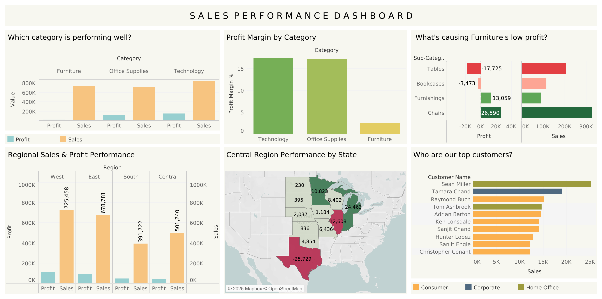

# Superstore Sales Analysis

**Date:** October 2025

## Overview
I analyzed Sample Superstore sales data to identify profitability issues across categories and regions.

**Tools:** PostgreSQL, Tableau  
**Dataset:** [Kaggle Sample Superstore](https://www.kaggle.com/datasets/vivek468/superstore-dataset-final)

## Key Questions
1. What's selling well? (Category performance)
2. What's causing the problem? (Sub-category deep dive)
3. Where are we making money? (Regional analysis)
4. Which states are underperforming? (State-level deep dive)
5. Who are our best customers? (Customer insights)

---

## 1. Which Category is Performing Well?

First, to find the best-performing category, I calculated total sales, profit, and profit margin for each category.

**SQL Query:**
```sql
select category, sum(sales) as "total sales", sum(profit) as "total profit”, round ((sum(profit) / sum(sales)) * 100, 2) as "profit margin %”
from sales
group by category
order by "total profit" DESC;
```

I grouped data by category and used the SUM() function to calculate total sales and profit for each. To find the profit margin, I divided total profit by total sales and multiplied by 100, then used ROUND() to limit it to 2 decimal places. I then sorted by total profit in descending order to show the highest-performing categories first.

**Results:**

| category        | total sales | total profit | profit margin % |
| --------------- | ----------- | ------------ | --------------- |
| Technology      | 836154.10   | 145455.66    | 17.40           |
| Office Supplies | 719046.99   | 122490.88    | 17.04           |
| Furniture       | 741999.98   | 18451.25     | 2.49            |

Technology leads with 145K profit and a healthy 17.4% margin,  followed by Office Supplies with 122K profit and 17% margin. Furniture is the problem — despite having similar sales (742K) to Technology, it generated only 18K profit with a very low 2.49% margin, showing major profit problems. The company should focus growth efforts on Technology and Office Supplies which have healthy margins, and reduce Furniture inventory in underperforming regions.

---

## 2. What's Causing Furniture's Low Profit?

Since Furniture showed poor profitability, I dug deeper to identify which sub-categories are causing the problem.

**SQL Query:**
```sql
select sub_category, sum(sales) as "total sales", sum(profit) as "total profit", round((sum(profit) / sum(sales)) * 100, 2) as "profit margin%”
from sales
where category = 'Furniture'
group by sub_category
order by "total profit" ASC;
```

I used WHERE clause to filter only Furniture, grouped by sub_category, and calculated totals. Then sorted by profit in ascending order to see the worst performers first.

**Results:**

| sub_category | total sales | total profit | profit margin % |
| ------------ | ----------- | ------------ | --------------- |
| Tables       | 206965.68   | -17725.59    | -8.56           |
| Bookcases    | 114880.05   | -3472.56     | -3.02           |
| Furnishings  | 91705.12    | 13059.25     | 14.24           |
| Chairs       | 328449.13   | 26590.15     | 8.10            |

Tables are losing significant money with -17.7K profit and -8.56% margin. Bookcases also show losses at -3.5K profit with -3.02% margin. Chairs and Furnishings are profitable, but Tables and Bookcases are losing too much money, dragging down the entire Furniture category. Either stop selling Tables and Bookcases or increase their prices by at least 10-15% to cover costs.

---

## 3. Where Are We Making Money?

Next, to find which regions are most profitable, I analyzed regional performance.

**SQL Query:**
```sql
select region, sum(sales) as "total sales", sum(profit) as "total profit",
from sales
group by region
order by "total profit" DESC;
```

I grouped data by region and calculated total sales and profit for each. Sorted by total profit in descending order to identify the most profitable regions.

**Results:**

| region  | total sales | total profit |
| ------- | ----------- | ------------ |
| West    | 725457.93   | 108418.79    |
| East    | 678781.36   | 91522.84     |
| South   | 391721.90   | 46749.71     |
| Central | 501239.88   | 39706.45     |

West leads with 108K profit and 725K sales, followed by East at 91K profit. Central generated only 39.7K profit despite having 501K in sales. South, with lower sales than Central, made more profit at 46.7K.

---

## 4. What's Wrong with Central Region?

Since Central showed poor profit despite decent sales, I dug deeper to find which states are dragging down the region's performance.

**SQL Query:**
```sql
select state, sum(sales) as "total sales", sum(profit) as "total profit"
from sales 
where region = 'Central'
group by state
order by "total profit" ASC;
```

I filtered for Central region using WHERE clause, grouped by state, and calculated total sales and profit. Sorted by profit in ascending order to identify the worst-performing states.

**Results:**

| state        | total sales | total profit |
| ------------ | ----------- | ------------ |
| Texas        | 170187.98   | -25729.29    |
| Illinois     | 80166.16    | -12607.89    |
| North Dakota | 919.91      | 230.14       |
| South Dakota | 1315.56     | 394.84       |
| Kansas       | 2914.31     | 836.45       |
| Iowa         | 4579.76     | 1183.81      |
| Nebraska     | 7464.93     | 2037.10      |
| Oklahoma     | 19683.39    | 4853.98      |
| Missouri     | 22205.15    | 6436.19      |
| Wisconsin    | 32114.61    | 8401.78      |
| Minnesota    | 29863.15    | 10823.22     |
| Indiana      | 53555.36    | 18382.97     |
| Michigan     | 76269.61    | 24463.15     |

Texas and Illinois are dragging down the Central region. Texas lost 25.7K despite having the highest sales (170K) in the region, while Illinois lost 12.6K. Together, these two states account for -38.3K in losses. Michigan (24.4K) and Indiana (18.4K) are the top performers, but the overall region still struggles due to Texas and Illinois. Recommend reviewing discount practices and product mix in Texas and Illinois to find why they're losing money despite strong sales.


---

## 5. Who Are Our Best Customers?

To find out the top customers, I analyzed total sales by customer and their segments.

**SQL Query:**
```sql
select customer_name, sum(sales) as "total sales", segment
from sales
group by customer_name, segment
order by  "total sales" DESC
limit 10;
```

I grouped by customer name and segment, summed their total sales, and sorted in descending order. Limited results to top 10 customers.

**Results:**

| customer_name      | total sales | segment     |
| ------------------ | ----------- | ----------- |
| Sean Miller        | 25043.07    | Home Office |
| Tamara Chand       | 19052.22    | Corporate   |
| Raymond Buch       | 15117.35    | Consumer    |
| Tom Ashbrook       | 14595.62    | Home Office |
| Adrian Barton      | 14473.57    | Consumer    |
| Ken Lonsdale       | 14175.23    | Consumer    |
| Sanjit Chand       | 14142.34    | Consumer    |
| Hunter Lopez       | 12873.30    | Consumer    |
| Sanjit Engle       | 12209.44    | Consumer    |
| Christopher Conant | 12129.08    | Consumer    |

Sean Miller is our top customer with 25K in sales. The top 10 customers all have sales above 12K. Consumer segment dominates with 6 out of 10 top customers, followed by Home Office (2) and Corporate (2).

---

## Tableau Dashboard



[View Interactive Dashboard on Tableau Public](https://public.tableau.com/views/SalesPerformanceDashboard_17613271462660/SalesDashboard?:language=en-US&:sid=&:redirect=auth&:display_count=n&:origin=viz_share_link)

---

## Files

- `queries.sql` — All SQL queries used in this analysis
- `sales-dashboard.png` — Tableau dashboard visualization
